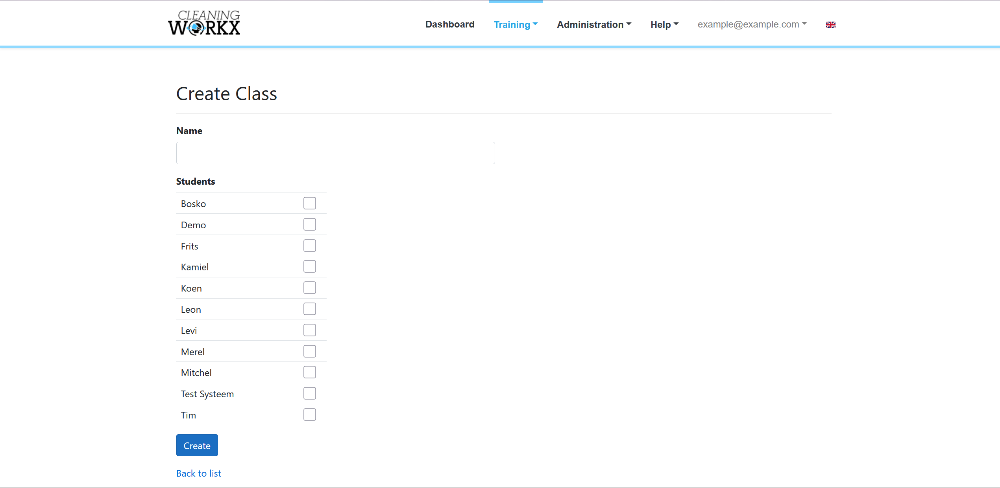
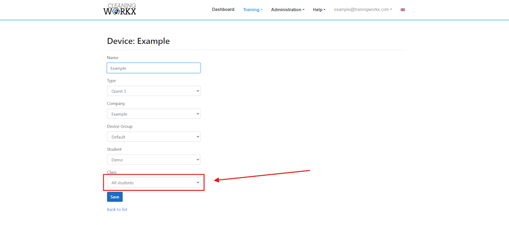

# Setting up groups

Groups allow multiple students to train using the same VR headset.  
Students within the same group can switch between users during training.

Groups are created and managed in the **Training Workx portal**.

portal.logisticworkx.com

---

## Creating a group

1. Log in to the **Training Workx portal**.
2. Go to **Training → Classes**.
3. Click **New Class**.
4. Enter a name for the group.
5. Select the students that belong to this group.
6. Save the group.

Choose a clear name so trainers can easily identify the correct group.

---

## Assigning a group to a headset

To allow students from a group to train on a headset, the headset must be linked to that group.

1. Go to **Training → Devices**.
2. Select the headset you want to use.
3. Choose the group that will train on that headset.
4. Save the changes.

---

## Switching students during training

Once a headset is linked to a group, students can switch users inside the VR training.

This can be done from the **student panel next to the module selection screen**.