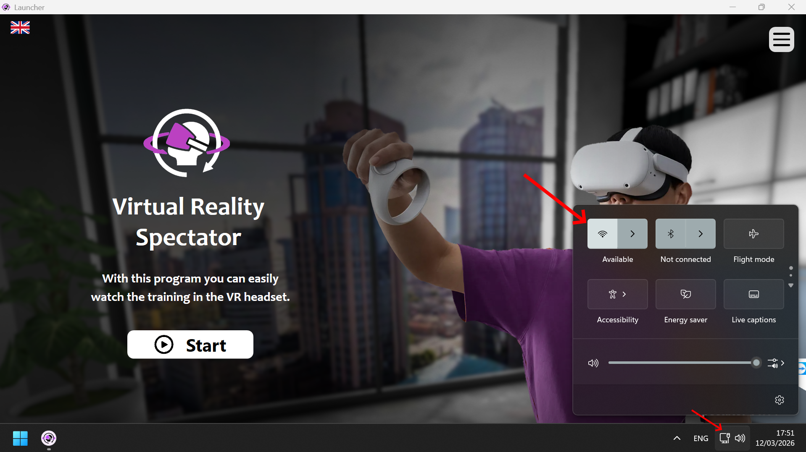
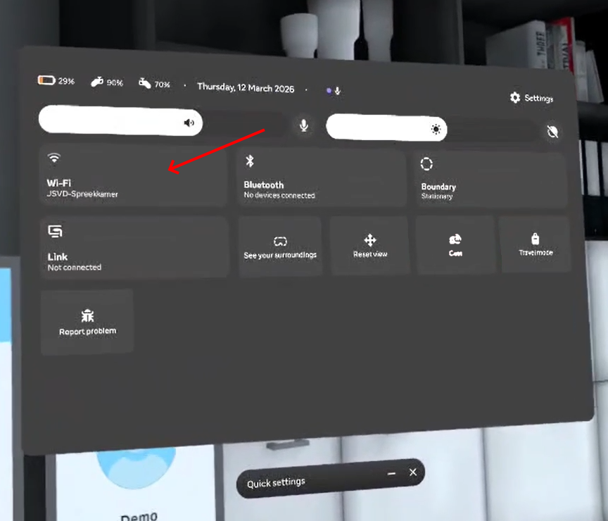
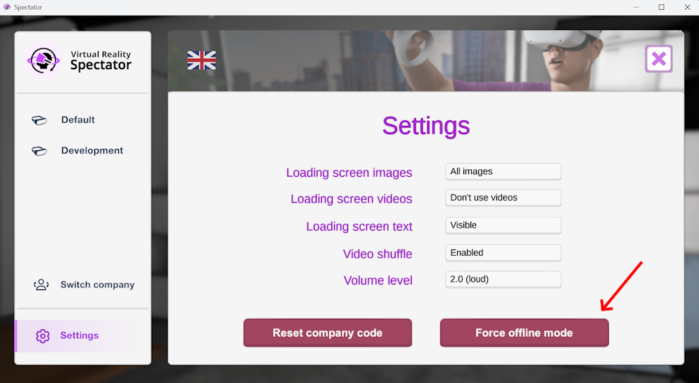

# No Wi-Fi connection

If the **Spectator** or the **headset** shows a **No Wi-Fi** popup, it may be possible that the box doesn't have enough cellular reception. There are a couple ways you can prevent this.

---

## 1. Move the box to a different location

Moving the box to a location with better connectivity is usually the best choice. Avoid strong steel constructions and move the box closer to windows and the outside.

If this isn't an option, or there is still not enough coverage, you can try seeing if the box and headset are connected correctly.

---

## 2. Retry connection

### If the popup appears on the box

1. Close the **training application**.  
2. On the touchscreen of the case, look at the **task bar** in the **bottom right corner**.  
3. Press the **Wi-Fi icon**.  
4. Check if the system is connected to the **VRCase** network.  

If it is not connected, select **VRCase** and connect to it.

---

### If the popup appears in the headset

1. Put on the **VR headset**.  
2. Press the **Meta (Oculus) button** on the controller to open the menu.  
3. Open **Quick Settings**.  
4. Select **Wi-Fi**.  
5. Make sure the headset is connected to the **VRCase** network.  

If it is not connected, select **VRCase** and connect to it.

---

## 3. After reconnecting

Once both the **case** and the **headset** are connected to **VRCase**, start the training application again. The **headset** and **Spectator** should now connect normally.

If you still don't have Wi-Fi, you will need to connect the box and headset to your own network. You can do this by going to the settings explained above and selecting your own network instead.

---

## 4. Offline mode

If using your own network also isn't an option, you can try using the headset's offline mode. This will allow you to see what the user is doing without an internet connection.

Keep in mind that this is only a backup solution, and that this means you won't be able to connect to your students and results data when using offline mode.

You can force offline mode by selecting **Settings** on the bottom left and then **Force offline mode** on the right.

---

If you get stuck with persistent internet connection issues, please contact support@cleaningworkx.com and we will help you get it fixed.

---