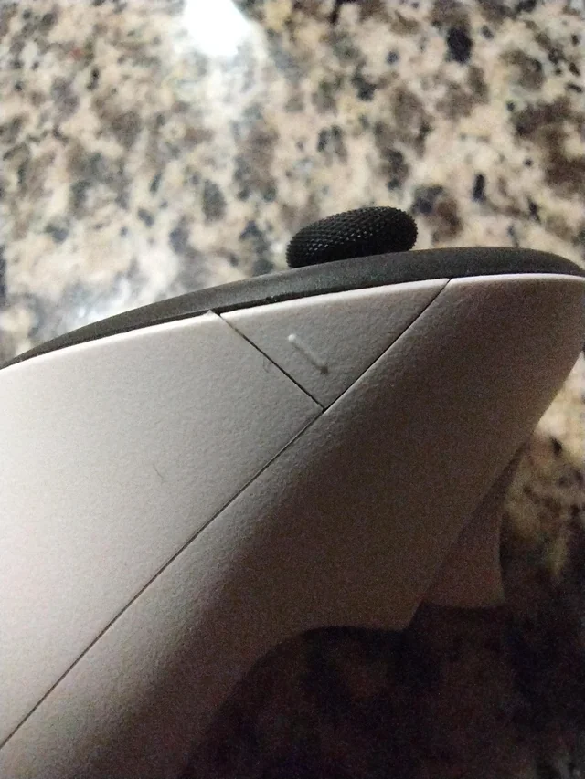

# Controllers not working

If the controllers are not responding in the VR headset, the batteries may be empty.

Follow the steps below to fix the issue.

---

## Check the controller batteries

Most controller issues are caused by **empty batteries**.

  

    <h3>Removing the battery cover</h3>
    <ol>
      <li>Hold the controller in your hand.</li>
      <li>On the side of the controller you will see a <strong>small white release button</strong>.</li>
      <li>Press this <strong>white button</strong>.</li>
      <li>The <strong>battery cover will pop out</strong> slightly.</li>
      <li>Remove the cover from the controller.</li>
    </ol>
  

  

    
  

### Replacing the battery

1. Remove the old battery.
2. Insert a **new AA battery**.
3. Place the battery cover back onto the controller until it clicks into place.

Repeat these steps for both controllers if necessary.

---

## Turn the controllers back on

After replacing the batteries:

1. Press any button on the controller.
2. Wait a few seconds for the controller to reconnect to the headset.

The controllers should now work normally in VR.

---

## If the controllers still do not respond

1. Restart the **VR headset**.
2. Turn the controllers on again.

If the issue continues, check that the batteries are installed correctly.