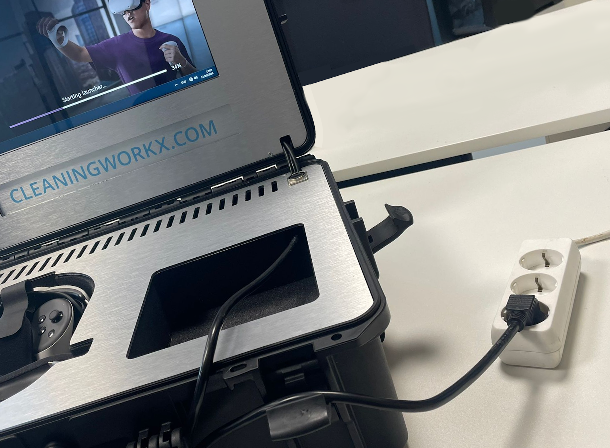
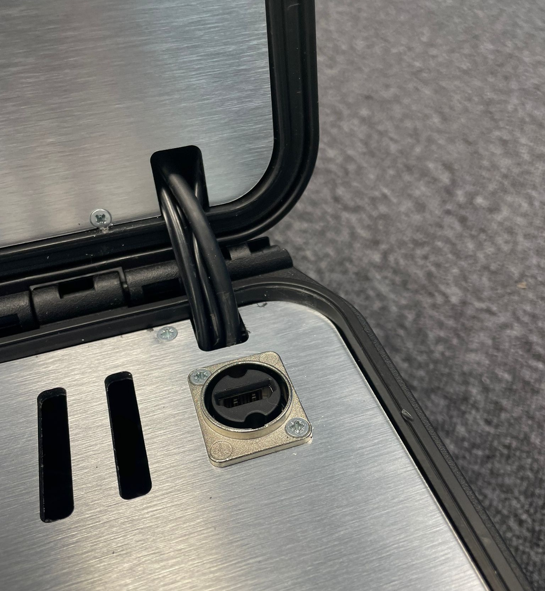
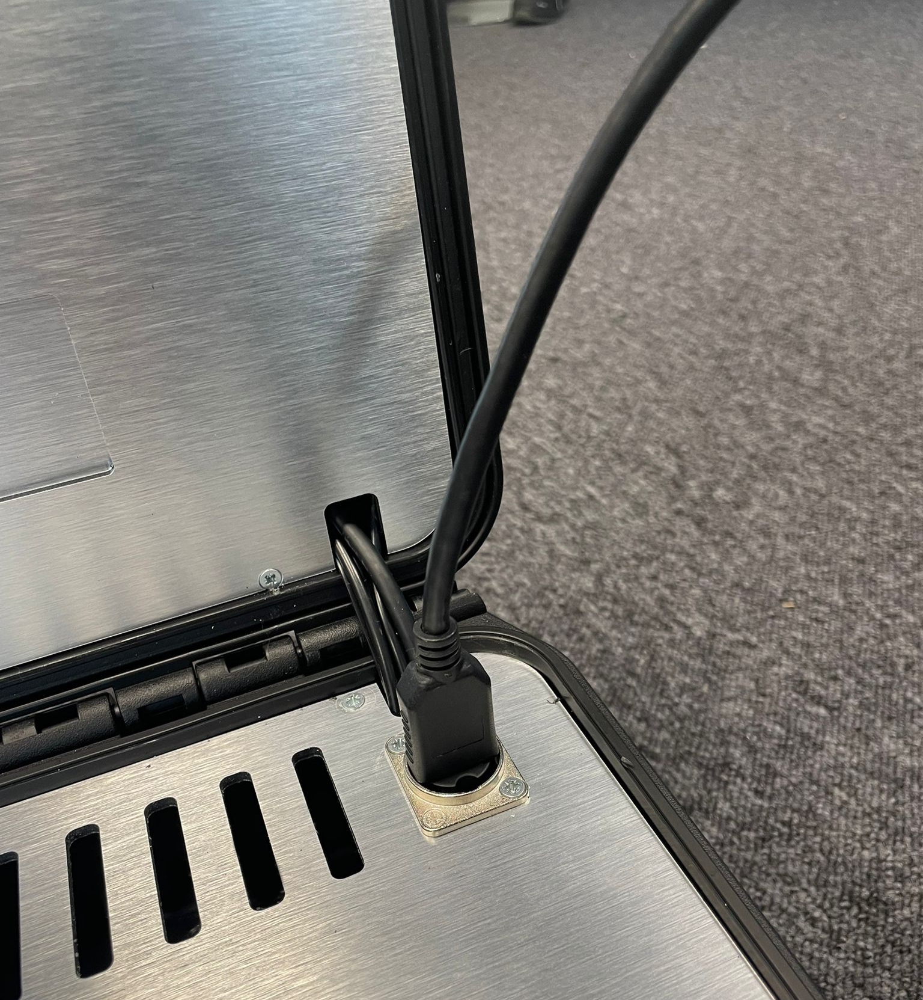
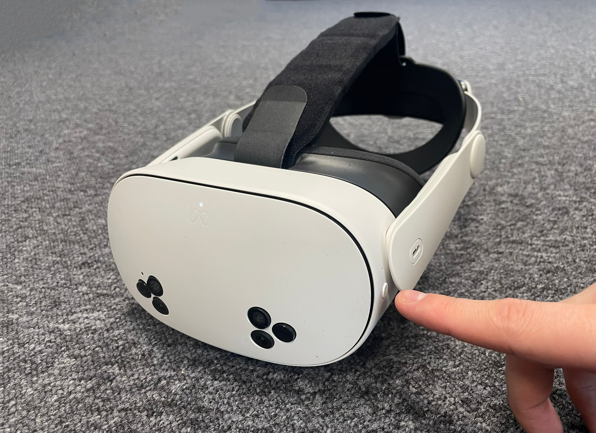
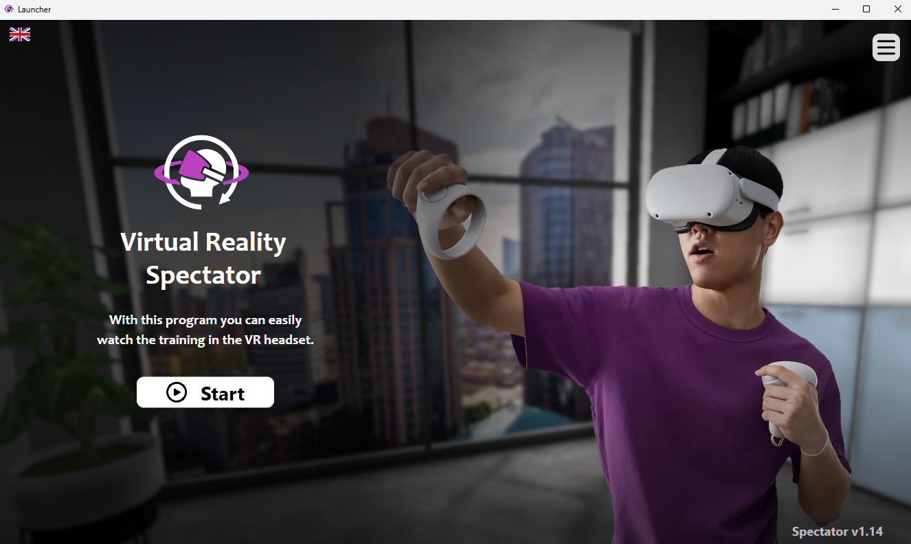
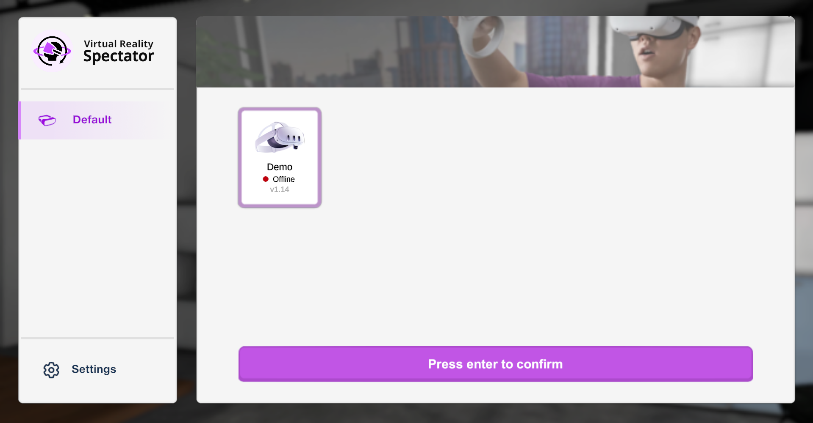
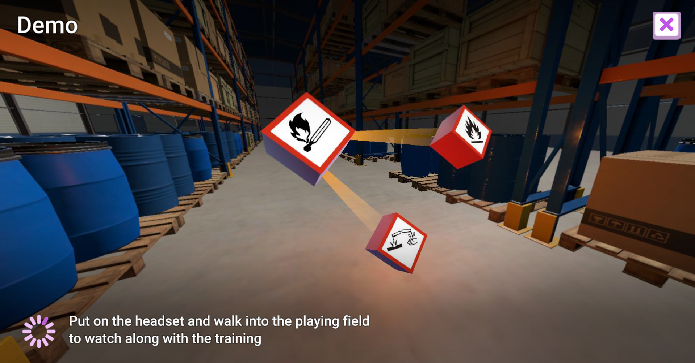

# Starting the box

This box allows you to easily stay up-to-date see what the trainee is doing with the VR training in the headset and start training as quickly as possible. The process for starting the box is quite easy.

---

## 1. Plug in the box

Plug in the headset into a wall socket. This will turn on the box and the screen automatically. This start up will take approximately 2 minutes.

---

## 2. Optional: Connect a screen

If you want to, you can now connect a screen to the HDMI cable in the box. Simply plug in the cable to the right corner of the box. The screen will automatically connect when you start the spectator.

    
    

---

## 3. Turn on the headset

While you're waiting for the box to start, you can turn on the Virtual Reality headset by pressing and holding the power button on the side. The headset will take a couple seconds to start up. You can then put on the headset.

---

## 4. Start the spectator

Now that the box has started up, you can Start the spectator by tapping the start button on the screen  of the box. Afterwards, you can select the headset that you want to watch.

    

---

## 5. Select headset

After the spectator has started, you can now select the headset. Select the headset you want to watch and press confirm.

    

---

## 6. Connecting

Your box will now automatically connect to the headset once it comes online. In the meantime, it will display a range of different images while it is loading.

    

The box is now fully set up and ready to use. All you need to do is put on the headset and start training. For more information on this, view [Using Your Box -> How to Use VR](3-how-to-use-vr.md).