# Setting up the play area (Guardian)

Before starting the VR training, you must set up the **play area**.  
This is called the **Guardian**. The Guardian creates a virtual boundary that prevents the user from walking into walls or objects while wearing the headset.

The Guardian is automatically remembered by the headset, so you only need to set it up when you visit a new location.

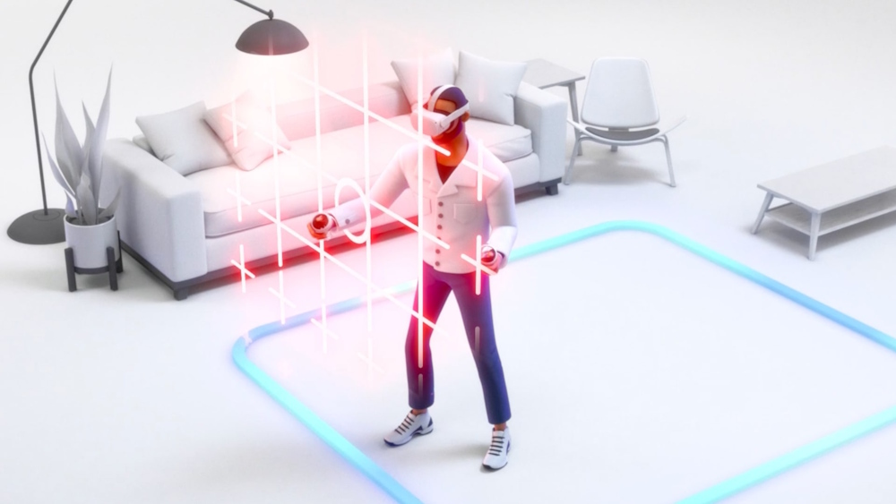

---

## Minimum space

For the best experience we recommend creating a large enough guardian. The recommended size depends on the training:

* **Sofia VR: 3.5 × 2.5 meters**
* **Tom VR: 4.5 × 3.0 meters**

Make sure there are **no objects inside the play area**, such as chairs, tables, or cleaning equipment.

---

## 1. Open quick settings

Press the menu button and select the **Quick settings** button on the bottom left. This will open the Quick Settings menu on your right.

    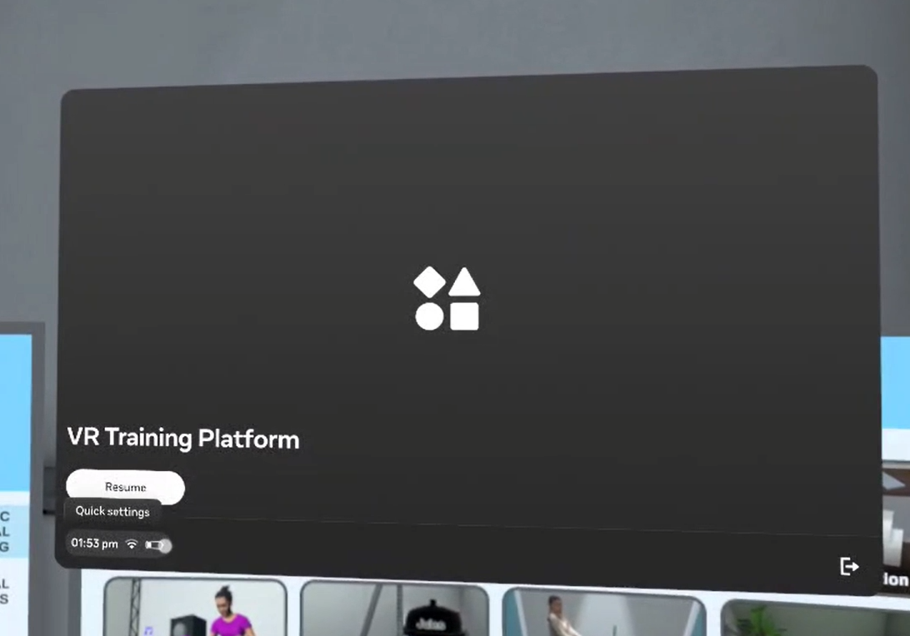

---

## 2. Open boundary settings

In the Quick Settings menu, select the **Boundary button** with your controller.

    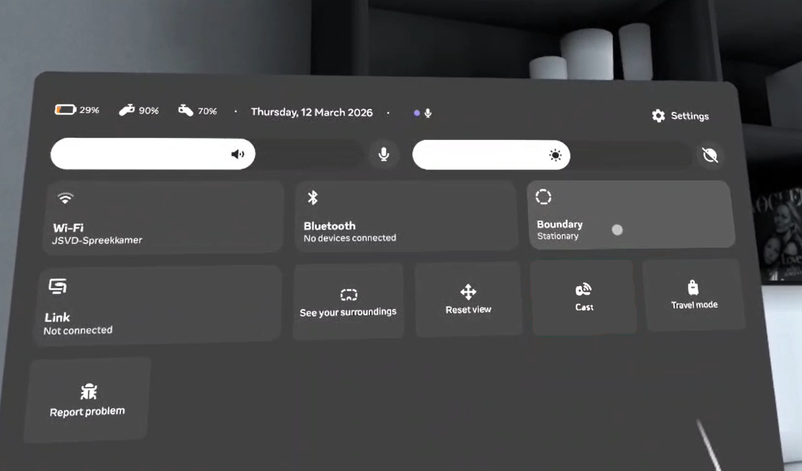

You can then select **Switch to Roomscale** (or **Adjust Roomscale** if you're already in the right mode).

    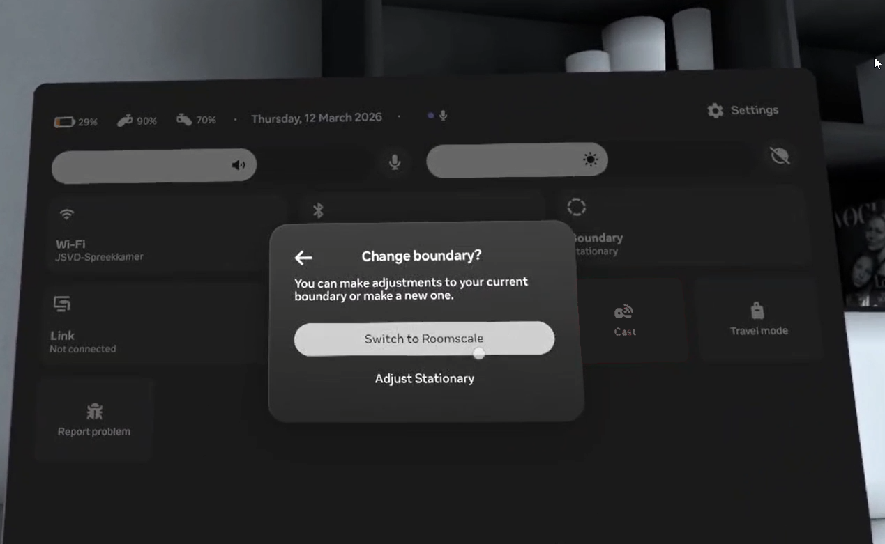

---

## 3. Select roomscale

Once you're in the guardian editor, you will now see a camera view of the real world. Here you can draw a new play area.

Always make sure you select **Roomscale**. Do not select Stationary.

    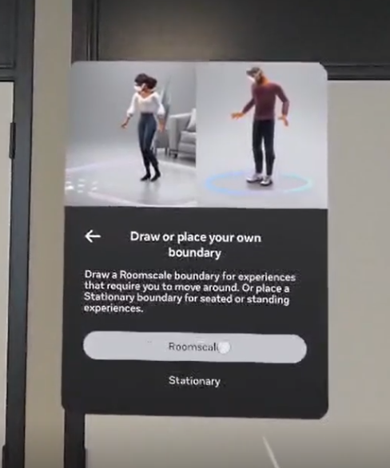

After selecting **Roomscale**, the system will make a boundary for you. This boundary is usually too big, so it is better to then select **Choose your own boundary**. This allows you to draw your own play area.

    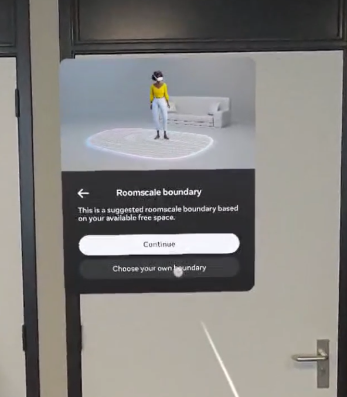

---

## 4. Drawing the boundary

The system will first ask you to confirm the floor level. It will automatically decide the floor level. If this is correct, can you can press **Confirm**. Otherwise, you need to select **Redo** and move your hands to the floor to calibrate this yourself.

    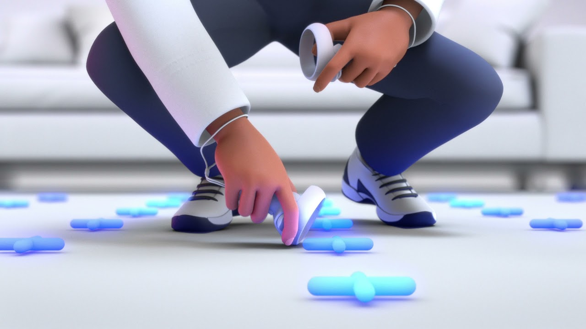
    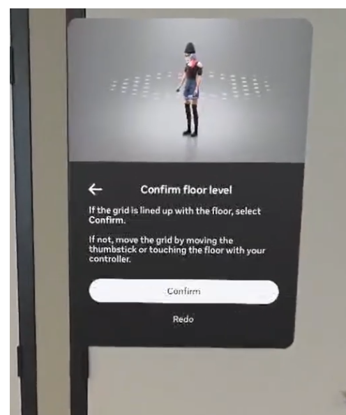

After confirming the floor level, you can then draw the boundary by yourself. You do this by pointing with your controller and using the trigger in your hand to draw on the floor.

    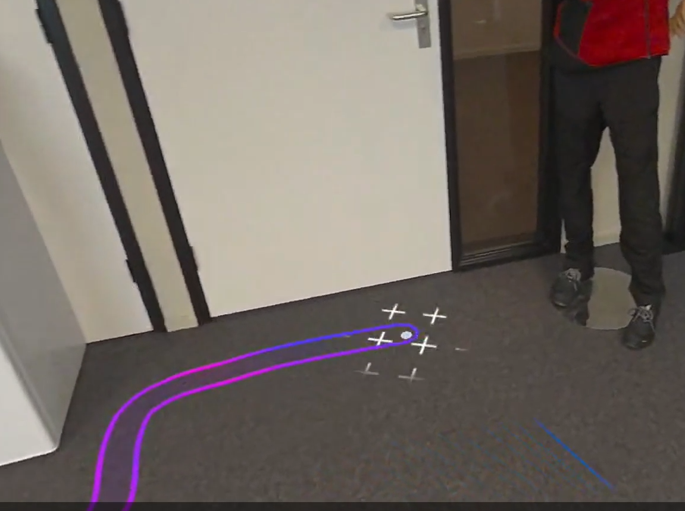

---

## 6. Confirm and return to training

Once you have completed drawing the boundary, you can look around to see if it's correct. If it is correct, you can select **Confirm**. Otherwise, you have to select **Redraw** and draw again.

    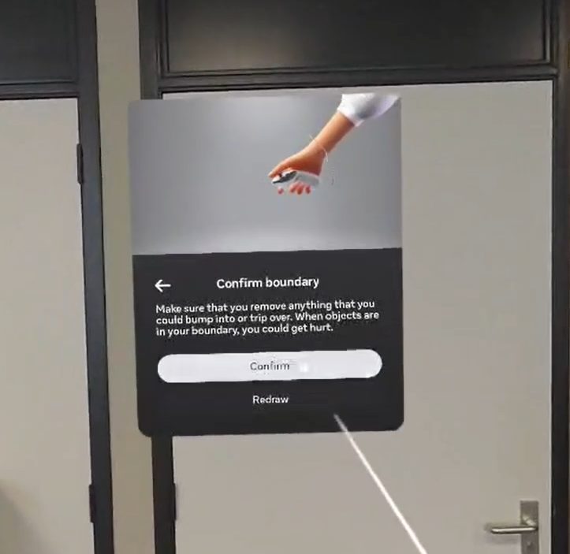

After the boundary is set up, you can now select the **Resume** button to go back to the training.

    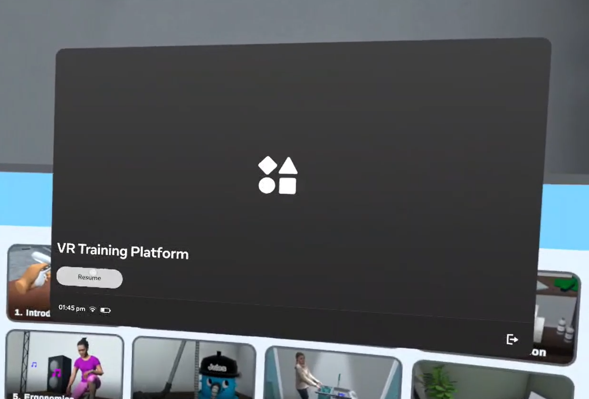

---

