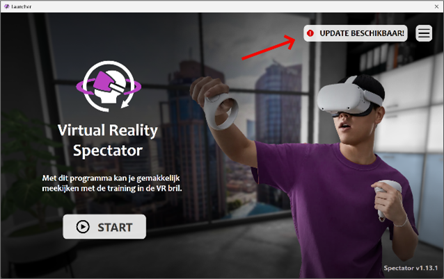

# Updating your box

The system can be updated to receive the latest improvements and training content.

Updates are managed through the **Launcher**, which opens automatically when the case starts.

---

## Downloading the update

Before an update can be installed, the new version must first be **downloaded**.

This download happens **automatically in the background** when the case is connected to the internet.

Depending on the internet connection, downloading the update can take **up to one hour**.

You can only install the update **after the download has finished**.

---

## Installing the update

Once the update has finished downloading:

1. Click on the **Update** in the Launcher.
2. Make sure the **VR headset is turned on**.
3. Connect the headset to the case using the **USB-C cable inside the case**.
4. Press **Update**.

The system will update both the **VR headset** and the **Spectator software**.

---

## Installation time

Installing the update usually takes **around 10 minutes**.

Make sure the headset stays connected during the update process.

---

## Important

The **headset and Spectator must always be updated together**.

Using different versions may cause connection problems.