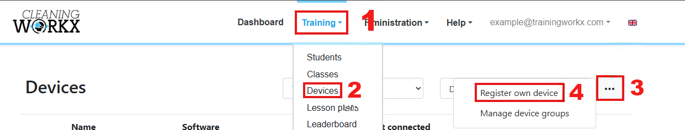

# Adding your own devices

If you want to use your own VR headset instead of one supplied by Training Workx, you must first register the device in the portal.

After registering the device, you can install the training software using the Launcher.

---

## Registering a device

1. Log in to the **Training Workx portal**.
2. Go to **Training → Devices**.
3. Click **Register own device**.
4. Add the new headset.

The headset will now appear in your device list.

---

## Installing the software

After registering the headset, you can install the training software.

1. Turn on the **VR headset**.
2. Connect the headset to your computer using a **USB-C cable**.
3. Open the **Launcher**.
4. Go to the **Update** section.
5. Click **Update** to install the software.

The installation process may take a few minutes.

---

## Identifying the headset

When the installation is complete:

1. Put on the VR headset.
2. Start the training application.
3. You will see a list of unregistered headsets.
4. Select the correct name for your device.

The headset will now be linked to your account and ready to use for training.

---

## Important

Your VR headset must be in **Developer Mode** for the installation to work.